# Weather Data Processing Pipeline

## 📋 Overview
A comprehensive data pipeline that collects, processes, and visualizes weather data using modern data engineering tools. The system processes weather data from NOAA (National Oceanic and Atmospheric Administration) and provides insights through interactive Grafana dashboards.


## 🚀 Setup and Installation

### Prerequisites
1. Install [Docker](https://www.docker.com/).
2. Install [Docker Compose](https://docs.docker.com/compose/).

### Steps
1. Clone the repository:
   ```bash
   git clone git@github.com:ntrg1317/weather-pipeline.git
   cd weather-pipeline
   ```

2. **Configure Environment**
   - Copy the sample environment file:
     ```bash
     cp sample.env .env
     ```
   - Update the following configurations in `.env`:
     - Airflow settings
     - MinIO credentials
     - Spark configurations
     - Cassandra connection details


3. **Deploy Services**
   ```bash
   docker compose up --build
   ```
   
4. Access the services:
   - Airflow: [http://localhost:8080](http://localhost:8080)
   - Spark: [http://localhost:9090](http://localhost:9090)
   - MinIO: [http://localhost:9000](http://localhost:9000)
   - Grafana: [http://localhost:3000](http://localhost:3000)

## 🧱 System Architecture


| Component   | Description                                                                 |
|-------------|-----------------------------------------------------------------------------|
| **Airflow** | Orchestrates the entire ETL workflow, triggered by the user or schedule.   |
| **NOAA S3** | Public data source of ISD-Lite and station metadata.                        |
| **MinIO**   | Stores raw data before processing.                                          |
| **Spark**   | Processes raw ISD-Lite data and joins with station metadata for aggregation.|
| **Cassandra** | Stores the final cleaned and aggregated weather data.                    |

## Cassandra Data Modeling
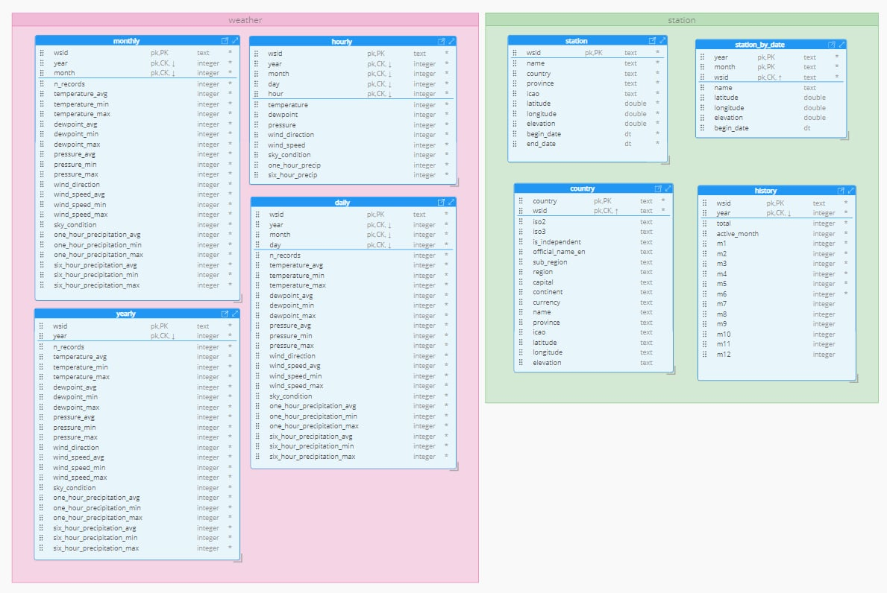

## 🔁 Data Flow (ETL Pipeline)

1. **Trigger** – User triggers an Airflow DAG.
2. **Fetch** – Airflow fetches:
   - ISD-Lite raw data files.
   - Station metadata and history CSVs.
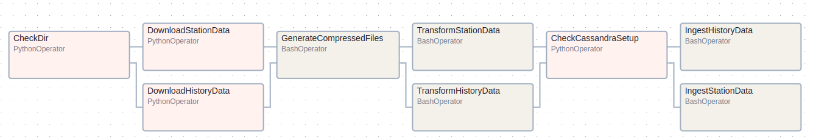
   
3. **Upload to MinIO** – Airflow uploads both datasets to MinIO.
   - Daily ingestion
      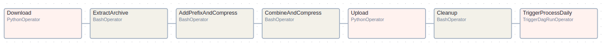
   - Yearly ingestion
   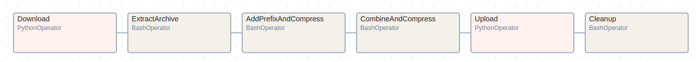
4. **Ingest to Spark** – Spark reads raw data from MinIO.
5. **Processing** – Spark:
   - Cleans and parses raw data.
   - Joins station metadata.
   - Aggregates by time, location, etc.
   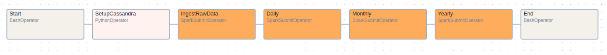
   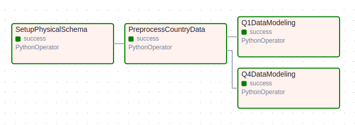
6. **Storage** – Aggregated data is stored into Cassandra.

## 📊 Grafana Dashboard
### The Grafana dashboard visualizes the following metrics:
- Country informations with all available stations
- Station informations and hourly, daily, monthly, yearly weather data records
### To configure the dashboard:
Download Cassandra connections then import to `/grafana/plugins/`

### Some images of the dashboard:
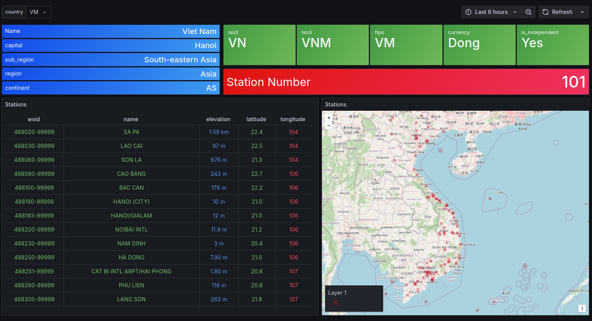
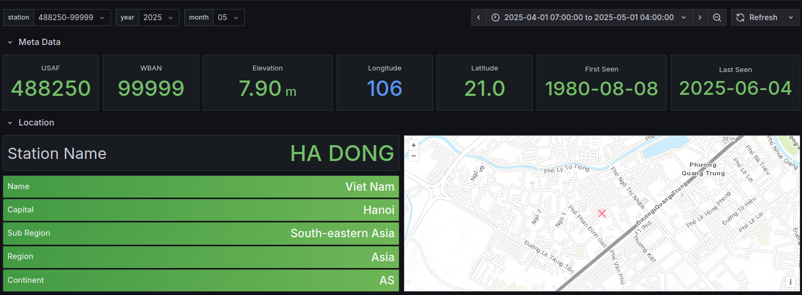
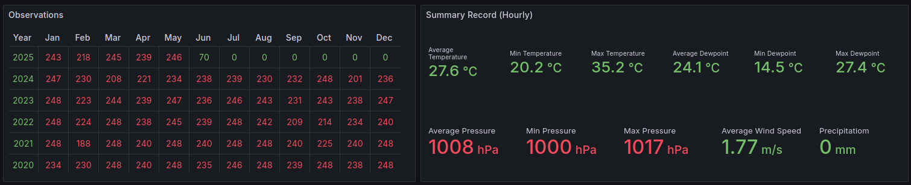
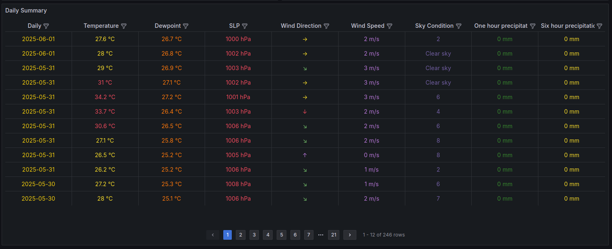
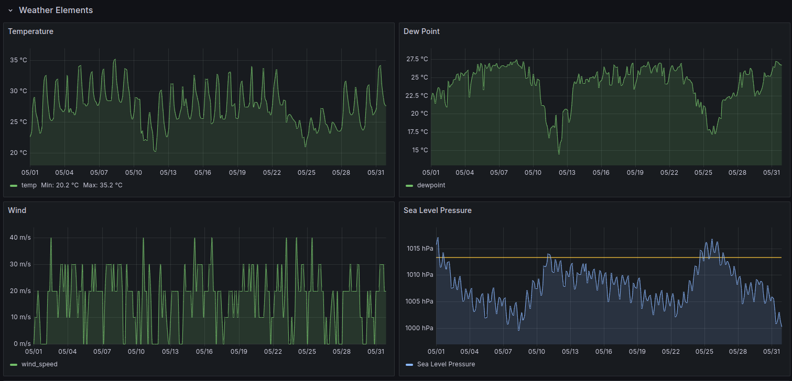
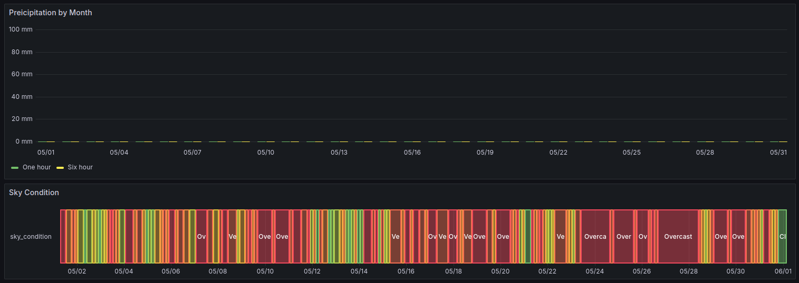


## 🛠 Troubleshooting
- Ensure all required ports are available before starting services
- Check container logs if any service fails to start
- Verify environment variables are properly set in `.env`

## 📬 Contact
Developed by  [TrangNguyen](mailto:trangnt1317@gmail.com)
 – Contact via GitHub or email.
